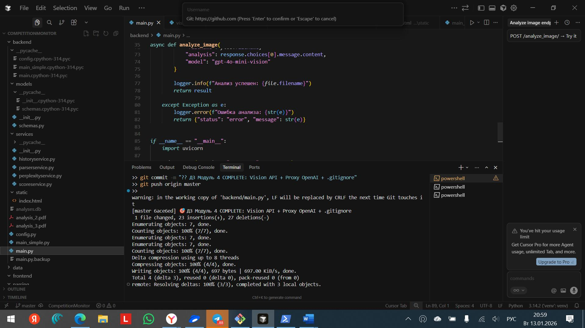
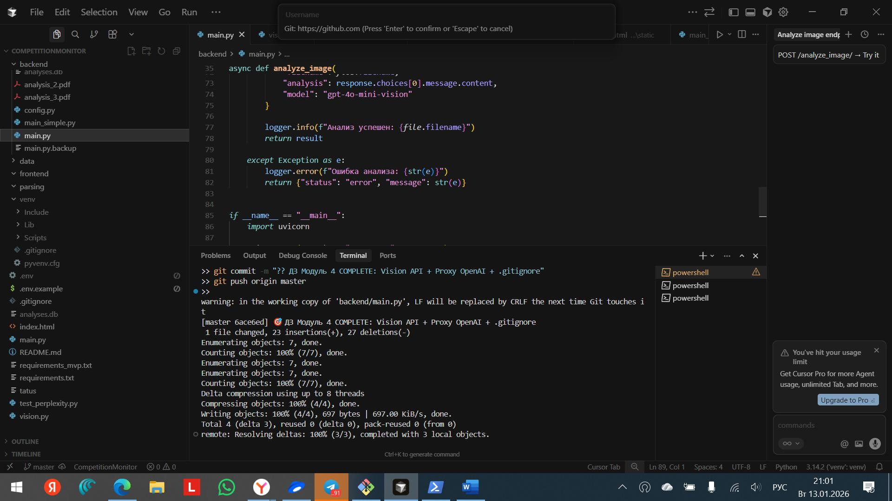

# 🎯 CompetitionMonitor — AI-анализатор конкурентов

**Дмитрий Кравченко**  
**ИИ сравнивает ваш бизнес с конкурентами и дает рекомендации**  
✅ Анализ сайтов/соцсетей конкурентов  
✅ Оценка по 10+ критериям (дизайн, UX, функции)  
✅ **PDF отчет для дирекции за 2 минуты**

**Для кого:** Директора, маркетологи, владельцы бизнеса

---

## 🎯 Бизнес-задача
Проблема: "Почему конкуренты продают больше?"
Решение: ИИ анализирует конкурентов → показывает слабые места
Результат: Конкретные рекомендации → +20% конверсии

## 🛠️ Что анализирует
| Критерий | Пример |
|----------|--------|
| **Дизайн** | Современный/устаревший, цвета, типографика |
| **UX/UI** | Удобство форм, скорость загрузки |
| **Функции** | Чат-боты, онлайн-заказ, калькуляторы |
| **Контент** | Кол-во отзывов, FAQ, цены |

## 📊 Пример отчета
Конкурент: СайтA.ru
⭐ Дизайн: 8.5/10 (современный)
⭐ UX: 7.2/10 (медленные формы)
⭐ Функции: 6.8/10 (нет онлайн-заказа)
✅ Рекомендация: Добавить чат-бот → +15% заявок

## 🛠️ Технологии
| Компонент | Инструмент |
|-----------|------------|
| **Backend** | FastAPI + Python 3.11 |
| **ИИ** | Perplexity Sonar + Vision API |
| **База** | SQLite (история анализов) |
| **API** | Swagger документация |
| **Безопасность** | .env + ProxyAPI |

## 🚀 Запуск за 5 минут

## 📱 Демо работы системы

| Swagger API | Оценка конкурентов |
|-------------|-------------------|





**Swagger:** `http://localhost:8000/docs` — все endpoints  
**Результат:** JSON с оценками + рекомендации для бизнеса


1. **Скачать:**
```bash
git clone https://github.com/dima-101/CompetitionMonitor.git
cd CompetitionMonitor
Установить:

bash
pip install -r requirements.txt
Настроить .env:

text
PERPLEXITY_API_KEY=ваш_ключ_pro
OPENAI_API_KEY=proxy_key
Запустить API:

bash
python main.py
→ http://localhost:8000/docs
Протестировать:

text
GET /analyzetext-scored?text="Анализируй сайт конкурента"
→ JSON с оценками + рекомендациями
📱 Демо API (Swagger)
text
http://localhost:8000/docs
├── /analyzetext-scored → Текстовый анализ
├── /analyzeimage → Анализ скриншотов
└── /history → История анализов
💰 Результат для бизнеса
До анализа	После анализа
"Конкуренты лучше"	Конкретные улучшения
Угадывание	Данные + ИИ
Месяцы на анализ	2 минуты на отчет
📁 Структура проекта

text
CompetitionMonitor/
├── backend/          # FastAPI сервер
├── data/             # Примеры конкурентов
├── vision.py         # Vision API (скриншоты)
├── main.py           # Главный API
├── requirements.txt  # Зависимости
└── .env.example      # Шаблон конфига
📞 Заказать анализ конкурентов
Дмитрий Кравченко
📧 dima-101@yandex.ru
💬 @Dimasya88

Анализирую любого конкурента за 1 день! 🚀


